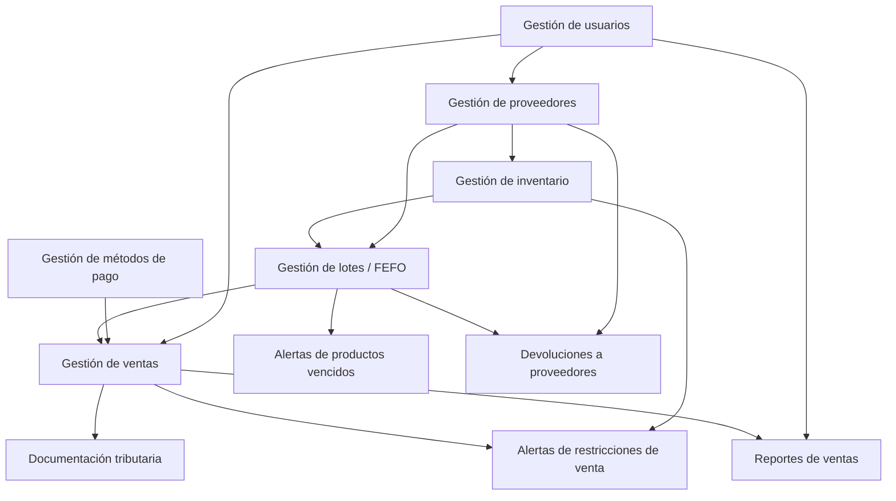

# Convenciones de Git y GitHub — FARMASIL_APP

> Referencia operativa para el equipo. Se aplica por igual a los issues de documentación (Bloque Planeación) y a los de código (Bloque Implementación) — mismo flujo, sin excepciones, así todo queda trazable en el mismo sistema. Colócalo también como `CONTRIBUTING.md` en la raíz del repositorio (o `.github/CONTRIBUTING.md`): GitHub lo enlaza automáticamente cada vez que alguien abre un issue o un PR, lo que ayuda justo con el escenario de compañeros que no leen documentación aparte.

## 1. Flujo general

```
Issue (tablero de Projects, estado: Todo)
   └─ actualizar y pullear main
        └─ crear rama desde main, nombrada con el número del issue
             └─ mover la tarjeta del issue a In Progress  ← manual, sin automatización nativa
                  └─ commits en esa rama, cada uno referenciando #<issue>
                       └─ push
                            └─ Pull Request → CI (GitHub Actions) en verde → revisión
                                 └─ Squash and merge a main  ← también manual (o "Enable auto-merge", ver sección 5)
                                      └─ rama eliminada automáticamente
                                      └─ issue cerrado automáticamente
                                      └─ tarjeta del Project pasa a Done automáticamente
```

Los dos pasos marcados como manuales (mover a In Progress, y fusionar el PR) son los únicos que no ocurren solos — GitHub no tiene forma de detectar "alguien empezó a trabajar" ni de fusionar sin que alguien lo confirme. Todo lo demás, desde que se aprieta el botón de merge en adelante, ocurre sin intervención — ver sección 6.

## 2. Nomenclatura de ramas

```
<tipo>/<numero-issue>-<descripcion-corta>
```

| Tipo | Cuándo | Ejemplo |
|---|---|---|
| `feat` | Módulo o funcionalidad nueva (Bloque Implementación) | `feat/14-modulo-ventas` |
| `docs` | Documento de arquitectura (Bloque Planeación) | `docs/2-vista-logica` |
| `fix` | Corrección de un bug | `fix/27-descuento-stock-fefo` |
| `chore` | Tooling, configuración, CI, esqueleto | `chore/1-esqueleto-solucion` |
| `test` | Pruebas automatizadas que no acompañan un módulo nuevo | `test/30-integracion-ventas-lotes` |

Siempre desde `main` (no hay `develop` ni ramas de release — con un equipo de una persona sosteniendo el proyecto y un solo release final, una rama por línea adicional es más proceso del que el proyecto necesita). El número de issue es obligatorio en el nombre: así cualquiera sabe, sin abrir nada, a qué tarea del tablero corresponde esa rama.

**Minúsculas y sin tildes/`ñ`** en la descripción corta (`actor-dueno`, no `Actor-Dueño`): consistencia con el resto de ejemplos de este documento, y evita que `cmd.exe` en Windows corrompa el nombre por su codificación por defecto.

**Importante:** el número de issue en el nombre de la rama es solo para lectura humana — GitHub no lo usa para vincular la rama al issue automáticamente, ni para mover la tarjeta del tablero. El único vínculo que GitHub reconoce y que cierra el issue + mueve la tarjeta a Done es `Closes #<numero>` en la **descripción del Pull Request** (sección 4).

## 3. Mensajes de commit — Conventional Commits + referencia al issue

```
<tipo>(<alcance>): <descripción en imperativo, minúscula, sin punto final>

<cuerpo opcional: qué y por qué, no cómo>

Refs #<numero-issue>
```

- **Tipo:** `feat`, `fix`, `docs`, `refactor`, `test`, `chore` — el mismo vocabulario que en los nombres de rama.
- **Alcance:** el módulo o documento afectado, en minúscula: `ventas`, `lotes`, `usuarios`, `vista-logica`.
- **Referencia al issue:** `Refs #14` enlaza el commit al issue (aparece en su historial) pero **no lo cierra**. Para cerrarlo automáticamente al fusionar, esa palabra clave va en la descripción del Pull Request, no en cada commit — ver sección 4. Si un commit intermedio ya resuelve el issue por sí solo y quieres cerrarlo ahí mismo, usa `Closes #14` en ese commit en vez de `Refs #14`.

Ejemplo real:
```
feat(ventas): registrar venta con selección de remesa por FEFO

Implementa el camino básico de ESP-0001: selección de medicamento,
propuesta automática de remesa según fecha de vencimiento, cálculo
del monto y confirmación.

Refs #14
```

**Cómo escribir el cuerpo multilínea sin que se rompa:** `git commit -m "título"` con un solo `-m` no admite saltos de línea reales — `\n` queda como texto literal. Tres formas que sí funcionan:
- `git commit` (sin `-m`) abre tu editor configurado (`git config --global core.editor "code --wait"` para VS Code) — control total de indentación.
- `git commit -m "título" -m "cuerpo del mensaje"` — cada `-m` es un párrafo aparte, funciona igual en bash/CMD/PowerShell.
- `git commit -F mensaje.txt` — escribes el mensaje en un archivo con la indentación exacta y git lo toma tal cual; es la más confiable en Windows/CMD.

Para no escribir la estructura a mano cada vez, `git config commit.template ~/.gitmessage.txt` precarga el esqueleto en el editor, o usa **Commitizen** (`npm install -g commitizen`, luego `git cz`) para que un cuestionario interactivo arme el mensaje formateado.

## 4. Pull Requests

- **Título:** mismo formato que el commit — `feat(ventas): registrar venta con selección de remesa por FEFO`.
- **Descripción:** obligatorio incluir `Closes #14` (o `Closes #12, #13` si el PR cierra más de un issue) — esto es lo que cierra el issue Y mueve la tarjeta del Project a Done automáticamente al fusionar. `Refs` no dispara ese cierre automático, solo `Closes`/`Fixes`/`Resolves`.
- **Checklist mínimo antes de pedir merge:**
  - [ ] CI (build + tests) en verde
  - [ ] Sin código o documentación a medias marcada `[pendiente]` sin explicar por qué
  - [ ] Definition of Done del issue cumplida
- **Revisión:** con equipo de fiabilidad incierta, no bloquees el flujo esperando una segunda persona — autorrevisa con el checklist de arriba y fusiona. Si un compañero sí participa, que revise antes de fusionar; si no, no se espera indefinidamente.

## 5. Fusión y limpieza

- **Estrategia: Squash and merge.** Cada PR se convierte en un solo commit sobre `main`, con el título del PR como mensaje — el historial de `main` queda limpio (un commit = un issue resuelto), aunque dentro de la rama hayas hecho commits de prueba y error.
- **El merge en sí no es automático:** aunque no haya conflictos y el CI esté en verde, alguien tiene que apretar "Squash and merge" en el PR — GitHub no lo hace solo. La única forma de que sí sea automático es activar **"Enable auto-merge"** en ese PR puntual (aparece junto al botón de merge): una vez activado, el PR se fusiona solo en cuanto el check `build-and-test` pase, sin volver a tocarlo. Es opcional — como ya te autorrevisas (sección 4) en vez de esperar una segunda persona, lo más simple es fusionar tú misma apenas veas el check en verde.
- **Eliminar la rama después del merge:** no lo hagas a mano — actívalo una vez como configuración del repositorio (sección 6) y ocurre solo, para cada PR, sin que nadie tenga que acordarse.

## 6. Configuración del repositorio (se hace una sola vez)

En **Settings** del repositorio:

1. **General → Pull Requests → "Automatically delete head branches"** ✅ — esto es lo que borra la rama sola tras cada merge.
2. **General → Pull Requests →** deja habilitado solo **"Allow squash merging"**, desmarca "Allow merge commits" y "Allow rebase merging" — así nadie puede fusionar de otra forma por error.
3. **Branches → Branch protection rule** sobre `main`:
   - Require a pull request before merging (nadie puede hacer push directo a `main`, ni tú misma sin querer)
   - Require status checks to pass before merging → selecciona el job `build-and-test` del workflow de Actions
   - Esto es lo que de verdad protege el proyecto de un compañero que empuja código roto directo a `main` — no depende de que nadie recuerde la convención, el repositorio la impone.

## 7. Relación con el tablero de Projects

Con `Closes #<numero>` en la descripción del PR y el merge fusionado:
- El issue se cierra solo.
- Si el Workflow "Pull request merged → Status: Done" está activo (ya lo configuraste), la tarjeta se mueve a Done sin tocar nada a mano.

No hace falta arrastrar tarjetas manualmente en ningún punto del flujo si el PR está bien enlazado al issue.

## 8. Etiqueta de entrega final

Al cerrar el sprint 12 (puesta en producción), crea un tag sobre el commit final: `git tag -a v1.0.0 -m "Entrega FARMASIL_APP — producción"` y `git push origin v1.0.0`. No hace falta versionar con SemVer estricto durante el proyecto (un único release final, no una serie de versiones públicas) — el tag es solo el marcador de "esto es lo que se entregó".

## 9. Si una rama queda abandonada

Si a mitad de sprint una rama asociada a un issue no tiene PR y el compañero asignado no responde en el check-in del lunes (ver política de resiliencia del plan Scrum), el issue se reasigna — normalmente a ti, dado el orden de prioridad ya definido — y la rama abandonada se elimina manualmente sin fusionar, para no dejar ramas muertas acumulándose en el repositorio.

## 10. Formato de diagramas

- **Por defecto: Mermaid**, en bloques ` ```mermaid ` dentro de un `.md` normal. GitHub lo renderiza nativamente (issues, PRs, wiki, cualquier archivo del repo) — sin exportar imagen, sin herramienta externa, y como es texto plano se puede diffear y revisar en el PR igual que código.
- **Excepción: PlantUML (`.puml`) + PNG exportado**, solo para el diagrama de componentes de la arquitectura genérica. Es el único que necesita notación UML de bola-enchufe (interfaces provistas/requeridas) para las que Mermaid no tiene soporte — el borrador en `ArquitecturaGenerica.md` ya la exige. GitHub no renderiza `.puml` en el visor de archivos, así que junto al `.puml` fuente va el PNG exportado (localmente, con la extensión de VS Code, o con un job de CI si más adelante se automatiza).
- **Un diagrama por issue:** ya está resuelto de fábrica — cada uno de los 8 issues del Bloque Planeación corresponde 1:1 a un tipo de diagrama/vista del curso.

**Estructura de carpetas:**
```
docs/diagramas/
├── arquitectura-generica.md      (Mermaid + sección UML formal con PNG)
├── diagrama-comportamiento.md
├── vista-logica.md
├── vista-procesos.md
├── vista-fisica.md
├── arquitectura-ui.md
├── arquitectura-datos.md
└── arquitectura-flujo-datos.md
```

Cada archivo lleva una sección `## Versión GitHub (Mermaid)` con el diagrama en texto, y — solo en `arquitectura-generica.md` — una segunda sección `## Versión formal (UML, notación bola-enchufe)` con el PNG exportado desde FigJam/PlantUML embebido debajo.

Ejemplo de `arquitectura-generica.md` (dependencias reales de los 11 módulos):
````
## Versión GitHub (Mermaid)



## Versión formal (UML, notación bola-enchufe)


````

Cada issue del Bloque Planeación cierra entonces con el documento (`ArquitecturaGenerica.md` u homólogo) **y** el archivo de diagrama correspondiente, en el mismo PR — un solo `Closes #<n>` cubre ambos.

## Checklist rápido

1. `git checkout main` y `git pull` — main actualizado antes de crear nada.
2. Crear la rama desde el issue: `git checkout -b <tipo>/<numero-issue>-<descripcion-corta>` — ejemplo real (issue #5, "Add CU-01 Actor - Dueño"): `git checkout -b docs/5-cu01-actor-dueno`
3. **Manual:** mover la tarjeta del issue en el tablero de Todo a In Progress.
4. Commits pequeños y frecuentes, `tipo(alcance): descripción`, `Refs #<numero-issue>` — ejemplo:
   ```
   git commit -m "docs(actor-dueno): agregar caso de uso CU-01 actor dueño" -m "Describe el actor dueño, sus responsabilidades y los casos de uso donde participa." -m "Refs #5"
   ```
5. `git push -u origin docs/5-cu01-actor-dueno`
6. Abres el PR, título igual al commit, descripción con `Closes #5`
7. Esperas CI en verde
8. **Manual, salvo que actives "Enable auto-merge" en el PR (sección 5):** Squash and merge.
9. Rama eliminada sola, issue cerrado solo, tarjeta en Done sola